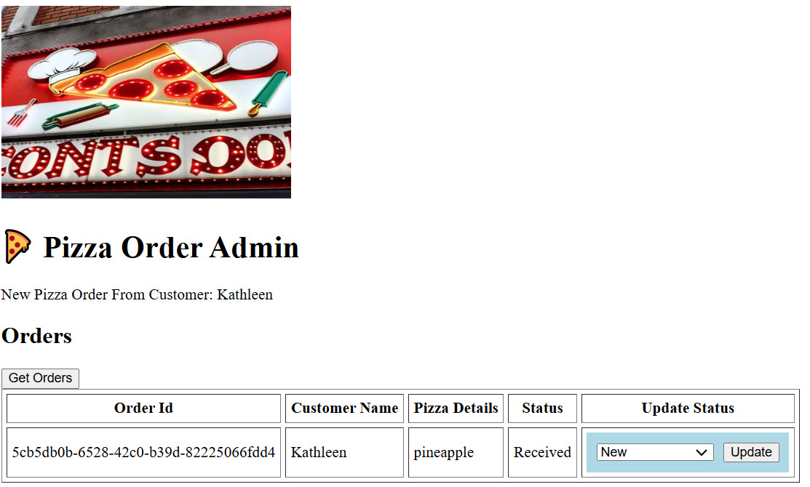
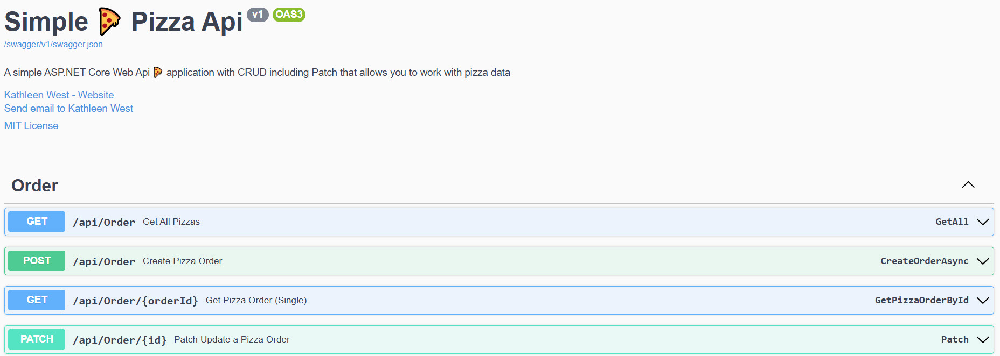
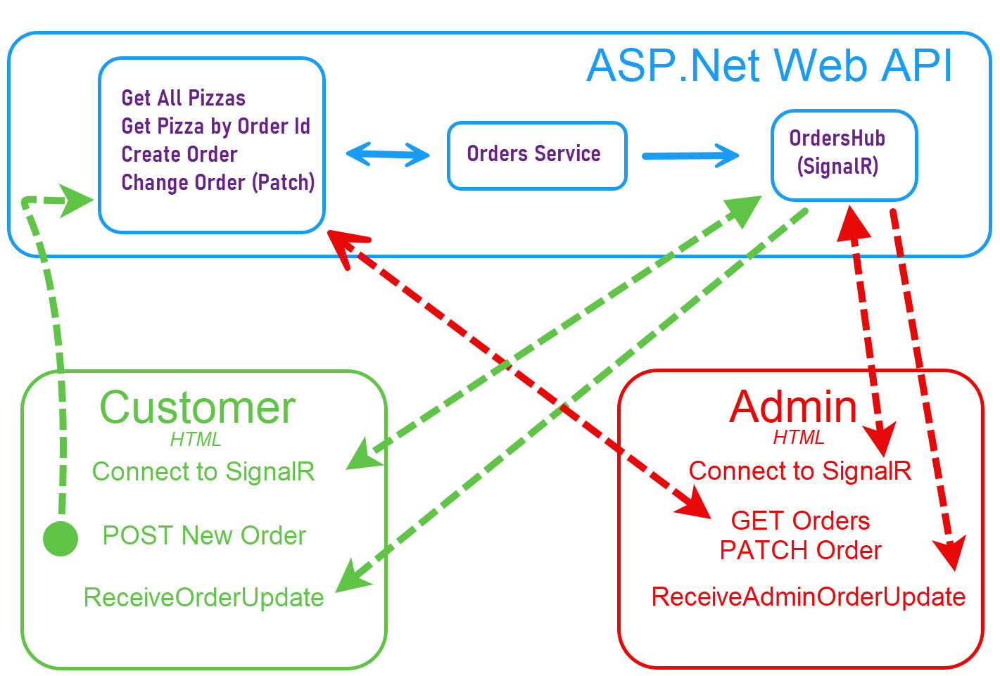

# Contoso 🍕 Pizza Ordering - ASP.Net Web Api and Web Application with SignalR - Demo and Tutorial

Table of Contents

##  1. Project Overview

A simple 🍕 pizza ordering web application (including a web API) with SignalR updates for customers and the admin pizza shop. A demo video is available that showcases the project in action and discusses the technical implementation.

Customers can order pizza and receive real-time updates on their orders using SignalR.
Pizza shop owners can receive real-time orders from customers and make order status updates that are delivered as real-time updates to their customers via SignalR.

##	2. Demo Links
Depending on the availability of the free hosting service, these links may be unavailable, but let's stay positive 😁

[🧍 Customer Pizza Order Page](http://orderpizzademo.runasp.net/)

[👩‍🍳 Pizza Shop Admin Page](http://orderpizzademo.runasp.net/admin.html)

[🌐 Demo Swagger Link](http://orderpizzademo.runasp.net/swagger/index.html)

##  3. Architecture
An overview of the project is shown in the architecture diagram below:

There are three main components:

- ASP.Net Web Api with SignalR Implementation
	- Get All Pizzas
	- Get Pizza by Order Id
	- Create Pizza Order
	- Update (PATCH) Pizza Order
	- Order Service
	- OrderHub (SignalR)
- Customer HTML Page with SignalR Connectivity
	- Connect to SignalR
	- POST new Pizza Order
	- Receive Order Update (SignalR)
- Pizza Shop Admin HTML Page with SignalR Connectivity
	- Connect to SignalR
	- Get All Pizza Orders
	- Update (PATCH) Pizza Order
	- Receive Admin Order Update (SignalR)

The visual studio solution is an asp.net web api with controllers, models, and services. There is one singleton service for the Orders management. Setup for SignalR is included with the OrdersHub and callback registrations. There are also static web pages for both the customer and admin pizza ordering interface to the web api and real-time updates connectivity using SignalR.

##  4. Swagger Documentation
Swagger documentation for the web api is available:

[Swagger Documentation](http://orderpizzademo.runasp.net/swagger/v1/swagger.json)

##  5. Demo and Tutorial YouTube Video

