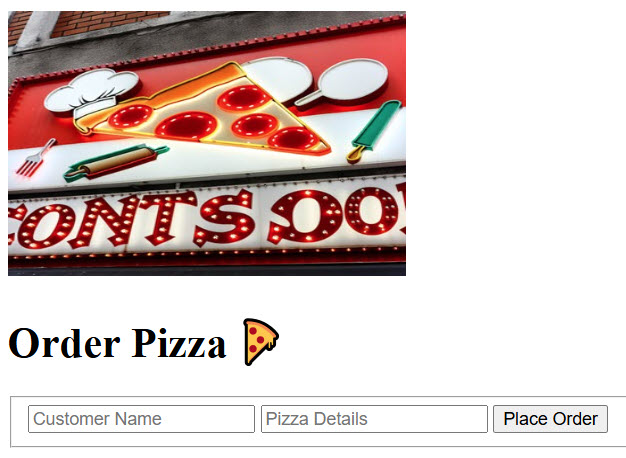
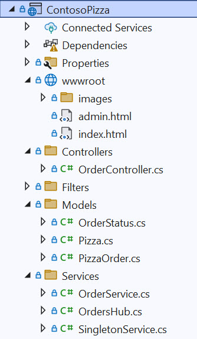

# Contoso 🍕 Pizza Ordering - ASP.Net Web Api and Web Application with SignalR - Demo and Tutorial

Table of Contents
<!-- vscode-markdown-toc -->
 * [Project Overview](#ProjectOverview)
 * [Architecture](#Architecture)
 * [Swagger Documentation](#SwaggerDocumentation)
 * [Demo and Tutorial Video](#DemoandTutorialVideo)

<!-- vscode-markdown-toc-config
	numbering=true
	autoSave=true
	/vscode-markdown-toc-config -->
<!-- /vscode-markdown-toc -->

##  1. Project Overview

A simple 🍕 pizza ordering web application (including a web API) with SignalR updates for customers and the admin pizza shop. A demo video is available that showcases the project in action and discusses the technical implementation.

Customers can order pizza and receive real-time updates on their orders using SignalR.
Pizza shop owners can receive real-time orders from customers and make order status updates that are delivered as real-time updates to their customers via SignalR.

##	2. Demo Links
Depending on the availability of the free hosting service, these links may be unavailable, but let's stay positive 😁

[🧍 Customer Pizza Order Page](http://orderpizzademo.runasp.net/)

[👩‍🍳 Pizza Shop Admin Page](http://orderpizzademo.runasp.net/admin.html)

[🌐 Demo Swagger Link](http://orderpizzademo.runasp.net/swagger/index.html)

##  2. Architecture
An overview of the project is shown in the architecture diagram below:

There are three main components:

- ASP.Net Web Api with SignalR Implementation
	- Get All Pizzas
	- Get Pizza by Order Id
	- Create Pizza Order
	- Update (PATCH) Pizza Order
	- Order Service
	- OrderHub (SignalR)
- Customer HTML Page with SignalR Connectivity
	- Connect to SignalR
	- POST new Pizza Order
	- Receive Order Update (SignalR)
- Pizza Shop Admin HTML Page with SignalR Connectivity
	- Connect to SignalR
	- Get All Pizza Orders
	- Update (PATCH) Pizza Order
	- Receive Admin Order Update (SignalR)

The visual studio solution is an asp.net web api with controllers, models, and services. There is one singleton service for the Orders management. Setup for SignalR is included with the OrdersHub and callback registrations. There are also static web pages for both the customer and admin pizza ordering interface to the web api and real-time updates connectivity using SignalR.

##  3. Swagger Documentation
Swagger documentation for the web api is available:

[Swagger Documentation](http://orderpizzademo.runasp.net/swagger/v1/swagger.json)

##  4. Demo and Tutorial Video

Welcome pizza lovers and tech enthusiasts to our exciting demo of a simple pizza-ordering web application! Get ready to see how we've combined the magic of real-time updates with the power of SignalR and a robust web API to create a seamless experience for both customers and pizza shop owners.

In this video, we'll walk you through our simple app. Watch as customers order their favorite pizzas and receive real-time updates on their orders, all thanks to SignalR. On the other side, pizza shop owners get instant notifications of new orders and can update order statuses in real-time, ensuring smooth operations and happy customers.

We'll also dive into the technical implementation, giving you an inside look at how SignalR and our simple web API work together to keep everything running smoothly. 

Architecture

Our project has three main components:
- A Web API with SignalR Implementation
- A Customer HTML Page with SignalR Connectivity
- A Pizza Shop Admin HTML Page with SignalR Connectivity

When a customer submits their order on the page, it will POST to the web API and create a new pizza order. The Orders Service then notifies the SignalR Hub to communicate to the admin pizza shop owner page that a new order has been placed. That SignalR callback method on the page triggers the page to call the web API, get all pizza orders, and refresh the page with the new orders. When the pizza shop owner changes the order status, a PATCH request is sent to the web API to update the order status. The change in order status triggers the Orders Service to use SignalR and send a callback to the customer with the new order status.

Our Visual Studio solution overview shows the server-side web API and SignalR implementation. The customer and pizza shop web pages are also shown in the solution and, for this demo, hosted on the same server. With SignalR, you are not limited to hosting the HTML pages on the same server. If you do decide to host elsewhere, you will need to update the CORS definition for your server to allow requests from other places.

SignalR Server-Side Setup

In the Program file, we need to add SignalR Server Builder to the web application builder services. In the same file, we will also need to map the Orders hub to the endpoints.

The Hub class can be set up with minimal implementation. Set up dependency injection to access the SignalR service in another service. Use the injected service to access SignalR implementation. In this example, we send a message to the subscribed topic "ReceiveOrderUpdate" on the customer pizza order page. We send the message only to the specified SignalR connected user with the connection identifier. Other SignalR service features are available.

SignalR Client-Side Setup

We must include the SignalR library on the client-side HTML page, which can be served from an external CDN or your own server. In our JavaScript example, we further define the SignalR configuration setup to connect to the Orders hub on the server. Next, define the start and on-close methods, then start the connection. Lastly, a callback method is defined to receive orders from the server based on a subscribed topic.

When we POST our new pizza order to the web API, we include the assigned SignalR connection identifier for our client HTML page. This connection identifier ensures that only targeted updates about our specific order are sent to our client browser window.

Sit back, relax, and let us take you on a tour of our simple pizza ordering system. With this in-depth demo and tutorial, you'll see just how easy it is to create a responsive and dynamic web application using ASP.NET, SignalR, and a web API.
